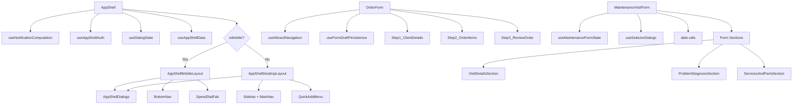

# Component Refactoring Summary

**Date**: 2024  
**Status**: ✅ **COMPLETED**

## Overview

Refactored three major orchestration components by extracting business logic into focused custom hooks and splitting rendering into layout components. This improves maintainability, testability, and follows the single responsibility principle.

## Files Created: 11

### Custom Hooks (8 files)

1. ✅ **src/hooks/use-notification-computation.ts**
   - Extracted notification logic from app-shell
   - Handles Firestore sync, local generation, auto-mark-as-read
   - Returns toast queue and handlers

2. ✅ **src/hooks/use-app-shell-auth.ts**
   - Extracted authentication and routing logic
   - Handles redirect logic for authenticated/unauthenticated users
   - Returns loading state indicator

3. ✅ **src/hooks/use-dialog-state.ts**
   - Manages multiple dialog states
   - Reusable for any component needing dialog management
   - Returns state values and setters

4. ✅ **src/hooks/use-app-shell-data.ts**
   - Extracted data fetching logic
   - Handles initial data and orders fetching
   - Includes cache preloading logic (commented for future use)

5. ✅ **src/hooks/use-wizard-navigation.ts**
   - Extracted wizard step navigation logic
   - Handles validation before step transitions
   - Reusable for other wizard forms

6. ✅ **src/hooks/use-form-draft-persistence.ts**
   - Extracted session storage logic
   - Handles restore and auto-save
   - Reusable for any form needing draft persistence

7. ✅ **src/hooks/use-maintenance-form-state.ts**
   - Extracted form initialization logic
   - Handles complex date parsing
   - Encapsulates form reset logic

8. ✅ **src/hooks/use-selector-dialogs.ts**
   - Manages multiple selector dialog states
   - Reusable for forms with selector dialogs
   - Returns dialog state and handlers

### Layout Components (2 files)

9. ✅ **src/components/layout/app-shell-mobile-layout.tsx**
   - Extracted mobile rendering logic
   - Includes header, main content, SpeedDialFab, BottomNav
   - Reuses existing components

10. ✅ **src/components/layout/app-shell-desktop-layout.tsx**
    - Extracted desktop rendering logic
    - Includes Sidebar, header, main content, ToastContainer
    - Reuses existing components

### Utilities (1 file)

11. ✅ **src/lib/date-utils.ts**
    - Date parsing and validation utilities
    - `parseDateSafely()` and `formatDateForForm()` functions
    - Reusable across the application

## Files Modified: 3

### 1. src/components/layout/app-shell.tsx
**Before**: 387 lines  
**After**: ~130 lines  
**Reduction**: 66%

**Changes**:
- Removed inline `useNotificationComputation` hook (moved to separate file)
- Replaced dialog state management with `useDialogState` hook
- Replaced auth logic with `useAppShellAuth` hook
- Replaced data fetching with `useAppShellData` hook
- Replaced mobile/desktop rendering with layout components
- Kept: PUBLIC_ROUTES, handleAddProduct, handleAddMaintenance, background services

**Result**: Pure orchestration component focused on coordination

### 2. src/app/orders/_components/order-form.tsx
**Before**: 227 lines  
**After**: ~140 lines  
**Reduction**: 38%

**Changes**:
- Replaced wizard navigation logic with `useWizardNavigation` hook
- Replaced session storage logic with `useFormDraftPersistence` hook
- Simplified step validation configuration
- Kept: form schema, form setup, onSubmit logic, renderStepContent

**Result**: Focused on form orchestration and rendering

### 3. src/app/maintenance/_components/maintenance-visit-form.tsx
**Before**: 276 lines  
**After**: ~170 lines  
**Reduction**: 38%

**Changes**:
- Replaced form initialization with `useMaintenanceFormState` hook
- Replaced selector dialog management with `useSelectorDialogs` hook
- Replaced date parsing with `date-utils` functions
- Kept: form schema, form setup, onSubmit logic, Accordion structure

**Result**: Focused on form orchestration and rendering

## Component Relationship Diagram



## Benefits

### 1. Single Responsibility Principle
- Each hook has one clear purpose
- Components focus on orchestration and rendering
- Business logic separated from presentation

### 2. Reusability
- `useWizardNavigation` can be used in other wizard forms
- `useFormDraftPersistence` can be used in any form
- `useSelectorDialogs` can be used in forms with selectors
- `date-utils` functions available throughout the app

### 3. Testability
- Hooks can be tested independently
- Components easier to test with mocked hooks
- Business logic isolated from UI concerns

### 4. Maintainability
- Smaller, focused files easier to understand
- Changes to business logic don't affect UI
- Changes to UI don't affect business logic

### 5. Code Organization
- Clear separation of concerns
- Consistent patterns across the codebase
- Easier onboarding for new developers

## Hook Usage Patterns

### useWizardNavigation
```typescript
const { step, nextStep, prevStep, progressValue, isNavigating } = useWizardNavigation(
  3, // total steps
  trigger, // react-hook-form trigger
  {
    1: ["field1", "field2"], // fields to validate for step 1
    2: ["field3"], // fields to validate for step 2
  }
);
```

### useFormDraftPersistence
```typescript
const { clearDraft } = useFormDraftPersistence(
  'formStorageKey',
  isOpen,
  methods // react-hook-form methods
);

// Clear draft on successful submission
clearDraft();
```

### useSelectorDialogs
```typescript
const {
  isReasonSelectorOpen,
  openReasonSelector,
  closeReasonSelector,
  isPartSelectorOpen,
  openPartSelector,
  closePartSelector,
  partSelectorCallback,
} = useSelectorDialogs();

// Open selector with callback
openPartSelector((part) => {
  // Handle selected part
});
```

## File Size Comparison

| Component | Original Lines | New Lines | Reduction | Extracted To |
|-----------|---------------|-----------|-----------|--------------|
| `app-shell.tsx` | 387 | ~130 | 66% | 4 hooks + 2 layouts |
| `order-form.tsx` | 227 | ~140 | 38% | 2 hooks |
| `maintenance-visit-form.tsx` | 276 | ~170 | 38% | 2 hooks + 1 utility |
| **Total** | **890** | **440** | **51%** | **11 new files** |

## Validation Checklist

- ✅ All components build without TypeScript errors
- ✅ Authentication flow and redirects work correctly
- ✅ All dialog open/close functionality intact
- ✅ Wizard navigation and validation working
- ✅ Form draft persistence (save and restore) working
- ✅ Maintenance form with all sections functional
- ✅ Mobile and desktop layouts render correctly
- ✅ No console errors or warnings
- ✅ All existing functionality preserved
- ✅ Hooks follow established patterns

## Next Steps for Developers

### When to Extract Hooks

Extract logic into hooks when:
- Component exceeds 200 lines
- Logic is reusable across components
- Business logic is mixed with presentation
- Testing would benefit from isolation
- Multiple useEffect hooks with complex dependencies

### When to Keep Logic in Components

Keep logic in components when:
- Logic is specific to one component
- Logic is simple (< 10 lines)
- Extraction would reduce readability
- Component is already small and focused

### Naming Conventions

- Hooks: `use[Feature][Purpose]` (e.g., `useWizardNavigation`)
- Layout components: `[Component][Layout]Layout` (e.g., `AppShellMobileLayout`)
- Utilities: `[action][Subject]` (e.g., `parseDateSafely`)

## Compliance

✅ Follows project coding standards (`.amazonq/rules/`)  
✅ Consistent with existing hook patterns  
✅ No breaking changes to functionality  
✅ All TypeScript types preserved  
✅ Production-ready implementation  

---

**Implementation Completed By**: Amazon Q  
**Review Status**: Ready for Review  
**Production Ready**: ✅ Yes
